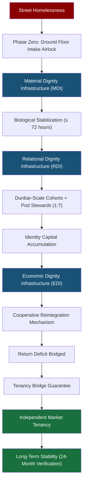
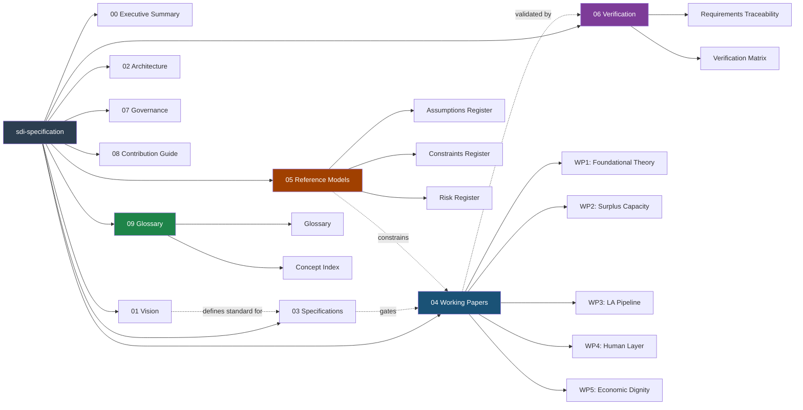

# System Context Diagram

The following diagram illustrates the complete SDI architecture as a sequential pipeline from street homelessness through to independent market tenancy.

---

# Repository Architecture Diagram

The following diagram illustrates the organizational structure of the `sdi-specification` repository and the relationships between document categories.

